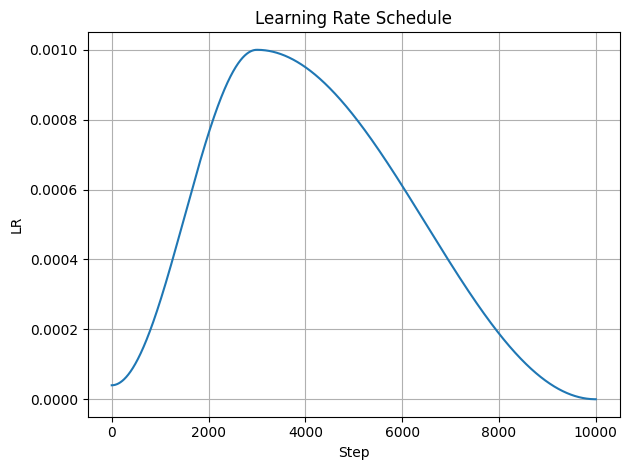
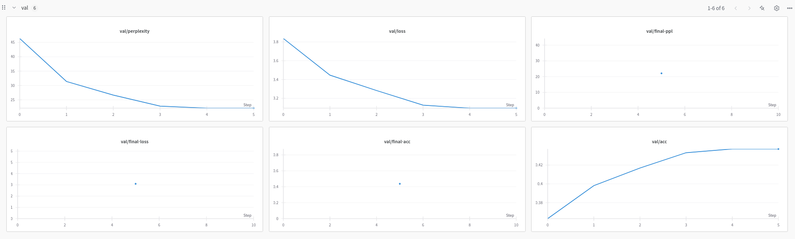
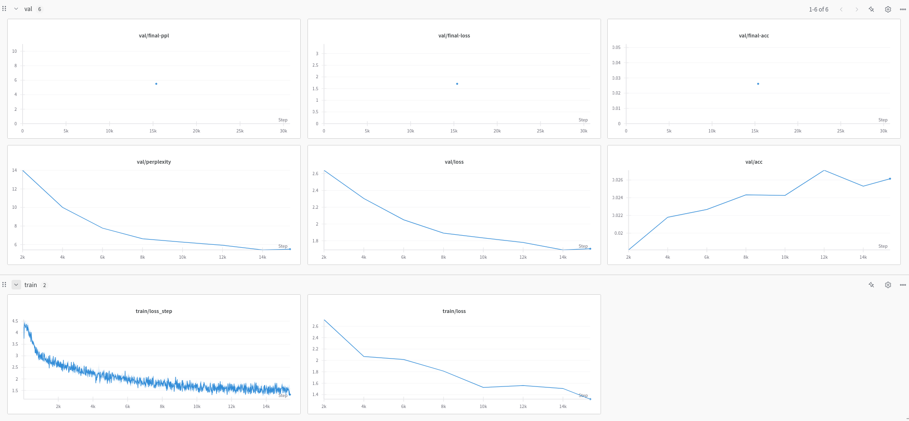

# Improving LLM training
Our work is heavily based on the last year's work of [Harold Benoit](https://www.haroldbenoit.com/).
You can see his work [here](https://github.com/HaroldBenoit/llm-efficient-training). He was able to substantially outperform the baseline.

Harold came up with many improvements over the provided baseline, such as better activation function, RoPE implementation compatible with torch compile, optimal model size, etc.

## What we tried, and worked
### Cycle scheduler
We used a cycle scheduler with a cosine annealing schedule. This means that learning rate starts small, is quickly increased a lot, and then decreased. This strategy is not used by the frontier models, because it is hard to get right with multi-gpu training, but we found in our case it beats other scheduling methods.



### Full fine tuning
Best way to fine tune on the `mathqa	` dataset was to optimize all the parameters.


### Pretraining vs. fine tuning time allocation
We pretrain the model on `slimpajama` for 3 hours and then fine tune on `mathqa` for another 1 hour. This is likely not the optimal split, if we had more time we would try pre-training for longer. 

### Bug Fix
The cross entropy loss is calculated incorrectly in the baseline, the ignore index that is set (-1) does not correspond to the token that is used for padding. This lead to mode only focusing on pad tokens during fine tuning and achieving incredibly low loss (there are a lot of padding tokens).

## What we tried, but did not work
### PEFT and LoRA
For fine-tuning on `mathqa`, we implemented LoRA and its variants – Loha, Lokr, but we found Loha and Lokr decreased the training process by x%. LoRA had a similar training speed as full-finetuning, but performed much worse on the validation loss. We followed the hyperparameters form [alignment-handbook](https://github.com/huggingface/alignment-handbook)

### Alternative optimizer
We included in the program the Lion(evoLved sIgn mOmeNtum) optimizer [link](https://arxiv.org/abs/2302.06675). It claims to be more memory efficient than Adam, but we were unable to test it extensively.

### Deploying on phone
The idea we wanted to implement was to be able to quantize the model and convert it after training, so that it could be run on a mobile device. We included the Quantization Aware Training (QAT) method that takes into account the “quantization loss” during training with the idea to perform post static quantization when the model is fully trained.

However, running the model without proper optimization (on the phone’s GPU) would lead to very large latency. The latter would require changing some layers of the PyTorch model, so that it is compatible with TorchScript. Unfortunately, this turned out to be beyond our time budget.

## How to run
We were in a rush to submit before the deadline. If you encounter any issues, please email [Mikulas Vanousek](https://people.epfl.ch/mikulas.vanousek/?lang=en) at his EPFL email address: 
We used 1 A100 GPU with 40GB to run the training. It consists of 2 parts: 
The first part takes 3 hours
The second part takes 1 hour
Before you can run the training for the first time, the dataset needs to be tokenized. We did not take this into account when measuring the time. Also, we run an evaluation of the model after it is trained. We also don’t consider this evaluation time in the 4 hours, you can turn off the evaluation in the config and run it manually after the training is done. 

### Install environment
We assume you have CUDA 12.4 on your system:
```
pip install -r req.txt
```

### Run first training (3h + evaluation unless disabled)
```
python src/main.py --config src/config/aaa/noam_wide4.yaml
```

### Run second training (1h +  evaluation unless disabled)
Make sure you put in the checkpoint from the last run is correctly in the config: it should be right by default. You can find the checkpoint path in the logs (on wandb)
```
 python src/main.py --config src/config/aaa/second_stage_full.yaml
```

## Results
### Preliminary
At the end of pretraining, we get the following results on the `slimpajama` dataset.
```
train loss: 3.162
val loss: 3.096
perplexity: 22.10
token_acc: 0.43719
```

### Final
After fine-tuning, we achieve the following results on the `mathqa` dataset:
```
train loss: 1.320
val loss: 1.705
perplexity: 5.50
token_acc: 0.026147
```

### Wandb Screenshots
#### Pretraining
For the pretraining, we only have validation loss (we do valuation only every 2000 steps).


#### Fine tuning



